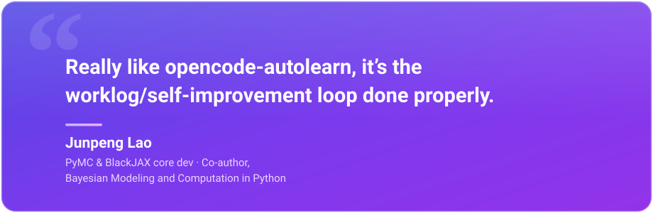

# opencode-autolearn

Self-improvement engine for [OpenCode](https://opencode.ai). Works with **both OpenCode v1 (`opencode`) and v2 beta (`opencode2`)**, installed side by side. Learns from your conversations, captures corrections and preferences, and escalates behavioral rules so your coding agent improves over time.

<p align="center">
  <a href="https://www.linkedin.com/feed/update/urn:li:activity:7481434645415477248/">
    
  </a>
</p>

## How it works

1. **Conversation monitoring** — A plugin hooks into OpenCode events, counting turns and buffering messages (with secret redaction). One shell serves v1 (`autolearn.js`, function-export plugin) and one serves v2 (`autolearn-v2.js`, plain-object plugin subscribing to the server event stream); all shared logic lives in `autolearn-core.mjs`.
2. **Review spawning** — At configurable turn thresholds, or when a session goes quiet, the plugin spawns a review subagent in a detached subprocess (via `opencode` or `opencode2`, whichever is present).
3. **Learning extraction** — The review agent evaluates conversations for corrections, preferences, workarounds, and patterns. It records observations, updates persistent memory, and creates or patches skills.
4. **Skill discovery** — Agent-created skills are symlinked into `~/.agents/skills/` so OpenCode auto-discovers them.

```
OpenCode session (v1 or v2)
  └─ autolearn plugin shells (v1 autolearn.js / v2 autolearn-v2.js)
       ├─ threshold reached? ──→ spawn review subprocess
       ├─ session quiet? ─────→ spawn review subprocess
       └─ process exit (v1)? ─→ spawn review subprocess
                                     │
                            autolearn-reviewer agent
                                     │
                      ┌──────────────┼──────────────┐
                      │              │              │
                  personas/      personas/       personas/
                  default/       default/        default/
                  memory.context user-profile.md skills/
                  (loaded into    (preferences)   (symlinked to
                   every session                   ~/.agents/skills/)

```

## Install

### One-liner (recommended)

```bash
curl -fsSL https://raw.githubusercontent.com/ericmjl/opencode-autolearn/main/install.sh | bash
```

This copies the plugin, installs the skills, patches your `opencode.json`, and initializes the store.

### Manual install

```bash
git clone https://github.com/ericmjl/opencode-autolearn.git
bash opencode-autolearn/install.sh
```

### What the installer does

1. Copies `plugin/autolearn.js` (v1), `plugin/autolearn-v2.js` (v2), and `plugin/autolearn-core.mjs` (shared) to `~/.config/opencode/plugins/`
2. Copies `skills/autolearn-reviewer`, `skills/autolearn-curator`, and `skills/self-improving-agent` to `~/.agents/skills/`
3. Patches `~/.config/opencode/opencode.json` to register the v1 plugin under `plugin`, the v2 plugin under `plugins`, the instructions entry, and the reviewer agent
4. Runs `autolearn.py init`, `retention score`, and `memory compose` to create and bootstrap `~/.autolearn/personas/default/`

### Verify

After installing, restart OpenCode. The plugin activates automatically. You can confirm by running:

```bash
uv run ~/.agents/skills/autolearn-reviewer/scripts/autolearn.py memory list
```

### Manual opencode.json config

If you prefer to edit `~/.config/opencode/opencode.json` yourself, here is what the installer adds. The `plugin` key is read by v1 (v2 ignores-then-normalizes it); the `plugins` key is native v2 (v1 ignores unknown keys). One file serves both versions:

```json
{
  "plugin": ["./plugins/autolearn.js"],
  "plugins": ["./plugins/autolearn-v2.js"],
  "instructions": ["~/.autolearn/personas/default/memory.context.md"],
  "agent": {
    "autolearn-reviewer": {
      "description": "Reviews past conversations for self-improvement opportunities",
      "hidden": true,
      "steps": 20,
      "prompt": "Load the autolearn-reviewer skill and follow its instructions to review the attached conversation for learning opportunities. Take immediate action: record observations, update memory, create or patch skills.",
      "permission": {
        "bash": "allow", "read": "allow", "glob": "allow", "grep": "allow",
        "write": "allow", "edit": "deny", "webfetch": "deny", "task": "deny",
        "skill": "allow", "external_directory": "allow"
      }
    }
  }
}
```

## OpenCode v1 + v2 (beta) compatibility

OpenCode 2 is a breaking change for the plugin API only — v1 plugins (function exports) cannot load in v2, and vice versa. Autolearn therefore ships two thin shells over one shared core:

| File | Plugin API | Loaded by | How |
|------|-----------|-----------|-----|
| `plugin/autolearn.js` | v1 (`export default async (ctx) => ({ event })`) | `opencode` | `plugin` config key |
| `plugin/autolearn-v2.js` | v2 (`{ id, setup(ctx) }` + `ctx.event.subscribe`) | `opencode2` | `plugins` config key |
| `plugin/autolearn-core.mjs` | — (shared module) | both | imported by the shells |

Behavioral differences worth knowing:

- **Event mapping** — v2 emits `session.inbox.enqueued` (user text), `session.text.ended` (full assistant text), and `session.execution.succeeded|failed|interrupted` (turn boundary). The v2 shell uses the execution-end events as the idle signal, so quiet-session reviews still fire.
- **Review subprocess binary** — reviews spawned from a v2 session run via `opencode2` (session cleanup uses `opencode2 api delete` since v2 has no `session delete` CLI); reviews from v1 run via `opencode` as before. The wrapper prefers `opencode2` when it is on PATH and no override is set.
- **Expected v2 warning** — v2 normalizes the v1 `plugin` key and will log one `failed to load plugin ... autolearn.js ... Expected object at ["default"]` warning per service start. This is expected and harmless: the `plugins` entry is what v2 actually loads. Remove the `plugin` entry once you retire v1.
- **Reviewer recursion guard** — in v2 the plugin runs inside the shared background service, so the env-var guard alone can't stop the reviewer's own sessions from being counted. The v2 shell also marks sessions by agent (`autolearn-reviewer`) and title (`autolearn*`) and skips them.
- **Exit reviews** — v1 reviews fire on process exit; v2's service outlives TUI sessions, so the v2 shell relies on threshold + turn-boundary reviews instead.

## Dependencies

- **[uv](https://docs.astral.sh/uv/)** — runs the Python CLI scripts with inline dependency resolution (no venv needed)
- **[Bun](https://bun.sh)** — runtime for the v1 plugin (bundled with OpenCode); the v2 plugin uses only Node-compatible APIs
- **Python ≥3.11** — for `autolearn.py` (dependencies resolved automatically via PEP 723 metadata)
- **OpenCode v1 (`opencode`) and/or v2 (`opencode2`)** — either or both; each loads its matching plugin shell

## Configuration

Config lives at `~/.autolearn/personas/default/config.yaml`:

```yaml
review_threshold: 5          # assistant turns between reviews
session_review_on_idle: true  # spawn review on session idle
max_conversation_buffer: 50   # max messages in buffer
curator_interval_days: 7      # how often to run curator
stale_after_days: 30          # days before skill → stale
archive_after_days: 90        # days before skill → archived
escalation_threshold: 3       # reinforcement count before curator suggests promotion to AGENTS.md
```

## CLI reference

```bash
# Initialize the autolearn store
uv run ~/.agents/skills/autolearn-reviewer/scripts/autolearn.py init

# Memory (loaded into every  
uv run ... autolearn.py memory add "Use uv tool for Python CLI tools, never pip3 install"
uv run ... autolearn.py memory list
uv run ... autolearn.py memory strengths
uv run ... autolearn.py memory strengthen <keyword>
uv run ... autolearn.py memory weaken <keyword>
uv run ... autolearn.py memory remove <keyword>

# User profile (communication/workflow preferences)
uv run ... autolearn.py user add "Prefers concise responses"
uv run ... autolearn.py user list
uv run ... autolearn.py user remove <keyword>

# Skills
uv run ... autolearn.py skill create <name> "<description>"
uv run ... autolearn.py skill patch <name> <section> "<content>"
uv run ... autolearn.py skill archive <name>
uv run ... autolearn.py skill list
uv run ... autolearn.py skill usage

# Curator (lifecycle management)
uv run ... autolearn.py curator run
uv run ... autolearn.py curator status

# Session search (FTS5 over past OpenCode conversations — both v1 and v2 sessions)
uv run ... autolearn.py search init [--full]      # build/update the search index
uv run ... autolearn.py search query "<terms>" \  # full-text search across messages
    [--limit N] [--context N] [--session ID] [--project NAME]
uv run ... autolearn.py search sessions "<terms>" # search session titles
uv run ... autolearn.py search status             # show index size and coverage

# Cross-machine sync (E2E-encrypted, opt-in)
uv run ... autolearn.py sync login [--server-url URL]  # derive master key, store in keychain
uv run ... autolearn.py sync push                      # encrypt + upload all local files
uv run ... autolearn.py sync pull [--full]             # download + decrypt + merge
uv run ... autolearn.py sync status                    # show server-side sync state
uv run ... autolearn.py sync export-key                # print base58 recovery key
uv run ... autolearn.py sync logout                    # remove master key from keychain

# Personas (isolated knowledge stores)
uv run ... autolearn.py persona create <name> "<description>"
uv run ... autolearn.py persona list                   # show all personas + UUIDs
uv run ... autolearn.py persona switch <name>          # set machine-wide default
uv run ... autolearn.py persona archive <name>         # mark read-only, disable sync
uv run ... autolearn.py persona rename <old> <new>
```

Most commands accept `--persona <name>` to operate on a specific persona (default: machine-wide default or `default`). The plugin auto-syncs on session start and after reviews when `AUTOLEARN_SYNC_API_KEY` is set — see [Privacy](#privacy) and [`docs/designs/sync/`](docs/designs/sync/).

Run `search init` once (before your first query) to populate the index from OpenCode's session DB. The reviewer skill does this on demand; to pre-build it manually, run `search init` and re-run periodically (or pass `--full` for a complete rebuild).

## Two CLIs, two stores

Autolearn ships **two** Python CLIs that work together. The README sections above cover `autolearn.py`; the second one comes from the `self-improving-agent` skill:

| CLI | Location | Store | Purpose |
|-----|----------|-------|---------|
| `autolearn.py` | `~/.agents/skills/autolearn-reviewer/scripts/autolearn.py` | `~/.autolearn/` | Memory, skills, curator, search |
| `improve.py` | `~/.agents/skills/self-improving-agent/scripts/improve.py` | `~/.agent-improvement/rules.yaml` | Behavioral rule tracking and AGENTS.md escalation |

The reviewer records corrections via `improve.py observe ...` (Step 4 of the reviewer skill), then `improve.py escalate --apply` promotes repeated rules into the appropriate `AGENTS.md` file. Common commands:

```bash
uv run ~/.agents/skills/self-improving-agent/scripts/improve.py status          # show all rules + counts
uv run ~/.agents/skills/self-improving-agent/scripts/improve.py observe "<rule>" --project <name> [--domain <domain>]
uv run ~/.agents/skills/self-improving-agent/scripts/improve.py due              # rules ready for escalation
uv run ~/.agents/skills/self-improving-agent/scripts/improve.py escalate --dry-run
uv run ~/.agents/skills/self-improving-agent/scripts/improve.py escalate --apply  # write to AGENTS.md
```

See [`skills/self-improving-agent/SKILL.md`](skills/self-improving-agent/SKILL.md) for the full escalation logic and domain taxonomy.

## Data layout

```
~/.autolearn/
├── personas/
│   └── default/               # default persona (no --persona flag)
│       ├── config.yaml            # thresholds and flags
│       ├── memory.context.md      # composed memory view (loaded into every
│       │                          # session via opencode.json instructions)
│       ├── memories.jsonl         # memory registry (source of truth)
│       ├── user-profile.md        # user preferences
│       ├── observations.jsonl     # event log (auto-trimmed to 1000 lines)
│       ├── strengths.json         # reinforcement counters per memory entry
│       ├── reviews/               # generated review markdown files
│       ├── search.db              # FTS5 index over past OpenCode sessions
│       ├── bin/                   # wrapper scripts (review-runner.sh)
│       ├── skills/                # agent-created skills
│       │   ├── {skill-name}/
│       │   │   └── SKILL.md
│       │   ├── .archive/
│       │   └── .usage.json
│       └── .curator_state.json
├── sync.yaml                  # sync config (server URL) — created by `sync login`
├── .encryption_salt           # per-installation salt for PBKDF2 key derivation
├── .persona_registry.json     # { name → uuid, sync_enabled } mapping
├── .default_persona           # machine-wide default persona name
└── debug.log                  # verbose plugin output (when AUTOLEARN_DEBUG=1)

~/.agents/skills/
├── autolearn-reviewer/        # installed skill (includes autolearn.py CLI)
├── autolearn-curator/         # installed skill
├── self-improving-agent/      # installed skill (behavioral rule tracker)
│   └── scripts/improve.py     # CLI for observe/escalate/stale
└── {learned-skill} → ~/.autolearn/personas/default/skills/{learned-skill}/  # symlinks

~/.agent-improvement/
└── rules.yaml                 # improve.py rule store (observations, counts, written_to)
```

## Design docs

Full design documentation lives in `docs/`:

- [`docs/high-level-design.md`](docs/high-level-design.md) — architecture, decisions, risk matrix. Each feature and decision is marked `shipped`, `partial`, or `planned`.
- [`docs/designs/`](docs/designs/) — 8 LLDs and 11 EARS specifications covering all shipped features (conversation monitoring, knowledge store, skill management, review agent, session search, sync encryption, sync protocol, multi-persona). See [`docs/README.md`](docs/README.md) for the status-indexed overview.

## Running the curator on a schedule

```bash
# Weekly curator via opencode-scheduler (v1 `opencode schedule`;
# v2 beta has no schedule subcommand yet)
opencode schedule "autolearn-curator" --cron "0 3 * * 0" \
  --agent autolearn-reviewer \
  --prompt "Load the autolearn-curator skill and run the curator."
```

## Troubleshooting

**`opencode2` logs a plugin warning for autolearn.js.** Under v2, a warning like `failed to load plugin .../plugins/autolearn.js ... Expected object at ["default"]` appears once per service start. This is expected: v2 normalizes the v1 `plugin` key and cannot load v1-style plugins, so it skips the v1 shell and loads `./plugins/autolearn-v2.js` from the `plugins` key instead. Verify with `opencode2 plugin list` — the `autolearn-v2.js` entry must not be `(failed)`. Once you retire v1, remove the `plugin` entry from `opencode.json` to silence the warning.

**Reviews silently failing.** When a threshold- or idle-triggered review fails to spawn, the plugin saves the formatted review (context + conversation) to `~/.autolearn/review-failed-{timestamp}.md`. List recent failures with `ls ~/.autolearn/review-failed-*.md`. The error itself is logged to `~/.autolearn/debug.log` (when `AUTOLEARN_DEBUG=1` is set) and to stderr — read the most recent failure file to see which conversation triggered it.

**Enabling debug output.** Set `AUTOLEARN_DEBUG=1` before starting OpenCode to write verbose plugin output to `~/.autolearn/debug.log`.

**Recursive review spawning.** The plugin guards against this with an `AUTOLEARN_REVIEWER=1` environment variable in the spawned subprocess. If you see rapid-fire review entries in `observations.jsonl` seconds apart, verify this guard is in effect.

**Search index issues.** If `search query` returns empty results, the index may not have been built yet. Run `search init` once to populate it, or `search init --full` for a complete rebuild. Use `search status` to check index size and coverage.

**Manual verification.** Confirm the store is healthy:

```bash
uv run ~/.agents/skills/autolearn-reviewer/scripts/autolearn.py memory list
uv run ~/.agents/skills/autolearn-reviewer/scripts/autolearn.py search status
uv run ~/.agents/skills/autolearn-reviewer/scripts/autolearn.py curator status
```

## Privacy

Autolearn records conversation excerpts locally to learn from them. By default **nothing leaves your machine**:

- All data lives under `~/.autolearn/` and `~/.agent-improvement/`.
- Messages are redacted of likely secrets (API keys, tokens, passwords) before buffering.
- The plugin and core CLI do not make outbound network requests. Sync is opt-in and E2E-encrypted: the plugin auto-pulls on session start and auto-pushes after reviews when `AUTOLEARN_SYNC_API_KEY` is set. Two interchangeable backends: **Fastify** (self-hosted, free, `sync-server/`) or **Convex** (managed, `sync-convex/`). See [`docs/high-level-design.md`](docs/high-level-design.md) Decisions 5–7.
- To wipe everything: `rm -rf ~/.autolearn ~/.agent-improvement` and remove the plugin/instructions entries from `~/.config/opencode/opencode.json`.

## Uninstall

There is no automated uninstaller. To remove manually:

```bash
# Remove plugin and installed skills
rm ~/.config/opencode/plugins/autolearn.js \
   ~/.config/opencode/plugins/autolearn-v2.js \
   ~/.config/opencode/plugins/autolearn-core.mjs
rm -rf ~/.agents/skills/autolearn-reviewer \
       ~/.agents/skills/autolearn-curator \
       ~/.agents/skills/self-improving-agent

# Remove local data stores (optional — keeps your learned memory/skills)
# rm -rf ~/.autolearn ~/.agent-improvement

# Edit ~/.config/opencode/opencode.json and remove the "autolearn.js" entry
# from "plugin", the "autolearn-v2.js" entry from "plugins", the
# "~/.autolearn/personas/default/memory.context.md" instructions entry, and
# the "autolearn-reviewer" agent entry.
```

## License

MIT
